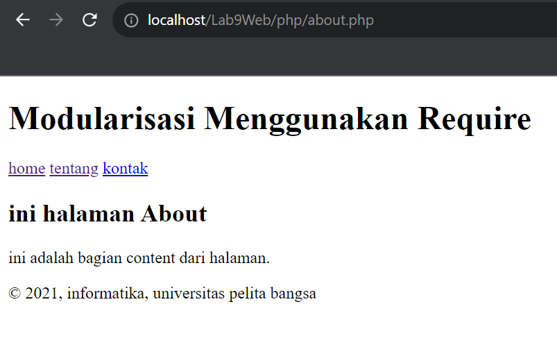

# langkah praktikum
1. Header

2. Home

3. About

4. Footer

## Output
1. header.php + footer.php + home.php

2. header.php + footer.php + about.php

# Pertanyaan dan Tugas
Implementasikan konsep modularisasi pada kode program praktikum 8 tentang
database, sehingga setiap halamannya memiliki template tampilan yang sama.